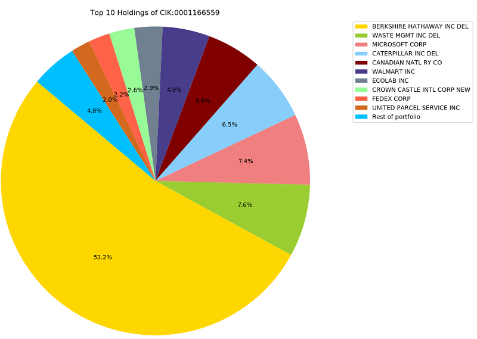

# Quovo Coding Challenge
My solution to the Quovo Coding Challenge is a command line tool that allows a user to generate .tsv file that outlines the holdings for any fund that is required to submit a 13F-HR form. Additionally, the tool supports a 'date filed' parameter in case the user is looking for an older 13F-HR. The tool also allows the user to instantly plot a pie-chart showing the top ten holdings, but more on that later!

### Setup and Installation
You'll need to install [BeautifulSoup](https://www.crummy.com/software/BeautifulSoup/bs4/doc/), in case the machine you will be using does not already have it installed.
```
pip install bs4
```

### Running the script
To use the example that was emailed to me, to generate the .tsv for CIK: 0001166559, run the following:
```
python edgar-search.py -cik 0001166559
```

This will create a file titled 0001166559.tsv in the same directory. You can run it as many times as you want and it will always return the most recently added 13F-HR.

### Parameters
```
python edgar-search.py -cik CIK -d DATE_FILED -g
```

The `-d` parameter allows you to specify a date on which the 13F-HR was filed. If there was actually a filing on that date, this will generate all the data from that 13F-HR. The date must follow format `YYYY-MM-DD` in order to work!

The `-g` flag does not need an argument, but when included it will display a neat graph like so:


### Additional Formats
I was looking out for some additional formats and it looks like this works on all of the [most recent 13F-HR filings](https://www.holdingschannel.com/13f/latest-filings/). I did encounter another format earlier but it was drastically different and would require an entirely different parsing approach. 

I am yet to find a 13F-HR on EDGAR that does not use XML. So, in order to build a parser that would support other formats, I would look for some key indicators of these different formats and then adjust my approach in `parse_13F_text_file`. BeautifulSoup is very versatile so once I have the format identified, it should be straightforward to adapt the parsing algorithm.